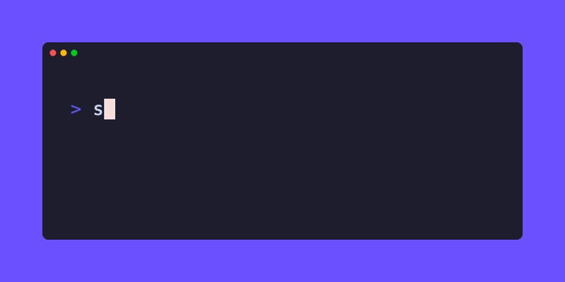

# skillcheck

Scan your machine for malicious AI agent skills in seconds.

```bash
npx @mondoohq/skillcheck
```



skillcheck detects locally installed AI agent skills, computes SHA-256 checksums, and checks them against the [Mondoo AI Agent Security](https://mondoo.com/ai-agent-security) database — covering prompt injection, credential theft, data exfiltration, and 25+ other threat categories across 1,200+ known skills.

## Supported Agents

| Agent | What's Detected |
|-------|-----------------|
| Claude Code | skills, plugins, MCP servers |
| OpenAI Codex | skills, plugins, MCP servers |
| Cursor | skills, MCP servers, rules |
| GitHub Copilot | skills, MCP servers |
| Goose | skills, extensions |
| Gemini CLI | skills, MCP servers |
| Windsurf | skills, rules, MCP servers |
| Roo | skills |
| Cline | skills |
| Kiro | skills |
| Continue | skills |
| Trae | skills |
| OpenCode | skills |
| Pi | skills |
| Mistral Vibe | skills |
| Antigravity | skills |
| OpenClaw | skills |
| IBM Bob | skills |
| Snowflake Cortex | skills |

## Usage

```bash
# Scan all detected agents
npx @mondoohq/skillcheck

# JSON output for CI/CD pipelines
npx @mondoohq/skillcheck --json

# Verbose output with full hashes and report URLs
npx @mondoohq/skillcheck --verbose
```

### CI/CD Integration

skillcheck exits with code **1** when critical or high-risk skills are found, making it easy to use as a gate:

```yaml
# GitHub Actions
- run: npx @mondoohq/skillcheck
```

```bash
# Any CI pipeline
npx @mondoohq/skillcheck --json --no-color
```

### Other Install Methods

```bash
# Install globally via npm
npm i -g @mondoohq/skillcheck
```

Binaries for macOS, Linux, and Windows are also available on [GitHub Releases](https://github.com/mondoohq/skillcheck/releases).

## What Gets Checked

For each detected agent, skillcheck:

1. Discovers installed skills, plugins, MCP servers, and rules
2. Computes a SHA-256 content hash for each skill
3. Queries the [Mondoo skill database](https://mondoo.com/ai-agent-security/skills) for known threats
4. Reports findings with severity, summary, and a link to the full security report

Skills that aren't in the database yet show as clean — skillcheck fails open, never blocks your workflow.

## Links

- [Mondoo AI Agent Security](https://mondoo.com/ai-agent-security)
- [Skill Database](https://mondoo.com/ai-agent-security/skills) — browse 1,200+ analyzed skills
- [Security Checks](https://mondoo.com/ai-agent-security/checks) — 25+ threat categories
