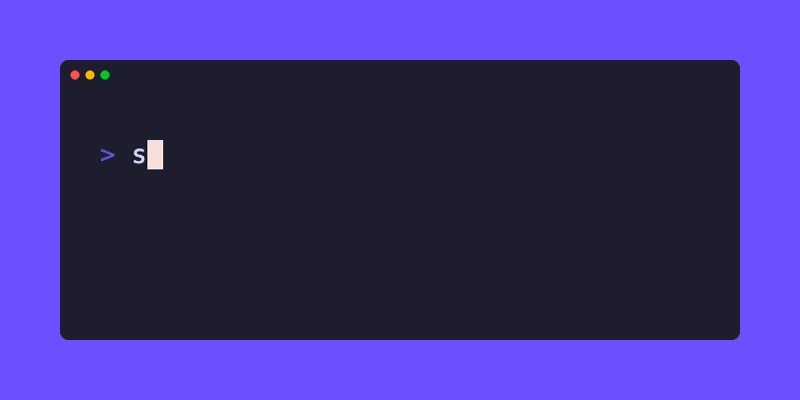

# skillcheck

Know whether the AI agent skills on your machine are safe — in seconds, with no install.

```bash
npx @mondoohq/skillcheck
```



AI coding agents load skills, plugins, and MCP servers that run with your permissions. A
malicious one can inject prompts, steal credentials, or exfiltrate code. skillcheck finds
everything installed across 25 agents — Claude Code, Cursor, Codex, Gemini CLI, Copilot,
Windsurf, and [more](https://github.com/mondoohq/skillcheck/blob/main/docs/supported-agents.md) —
and checks it against the [Mondoo AI Agent Security](https://mondoo.com/ai-agent-security)
database of 1,200+ analyzed skills and 25+ threat categories.

## What you can do with it

### Find out if your machine is exposed

Run it once and get a verdict for every skill, plugin, and MCP server your agents can load:
severity, a one-line summary of the threat, and a link to the full security report.

```bash
npx @mondoohq/skillcheck            # scan every detected agent
npx @mondoohq/skillcheck --verbose  # include content hashes and report URLs
```

### Stop risky skills from reaching your builds

skillcheck exits **1** when it finds a critical or high-risk skill, so it works as a gate in
any pipeline, dev container, or onboarding script:

```yaml
# GitHub Actions
- run: npx @mondoohq/skillcheck
```

```bash
# Any CI system: machine-readable output, no color codes
npx @mondoohq/skillcheck --json --no-color
```

It fails open: a skill the database hasn't analyzed yet shows as clean and never blocks you.

### Ship a skills repository that agents can actually load

If you publish skills, `validate` checks your repository against the
[Agent Skills](https://agentskills.io/specification) and [AGENTS.md](https://agents.md/)
specifications — catching broken frontmatter, bad skill names, oversized descriptions,
links to files the skill doesn't ship, and a missing `AGENTS.md` or marketplace manifest
before your users do. It finds every `SKILL.md` in the repository, including skills nested
in plugin directories and skills packaged as `.skill` archives.

```bash
npx @mondoohq/skillcheck validate .                    # current directory
npx @mondoohq/skillcheck validate ./my-skills --json   # any path, JSON output
```

```text
Validating /path/to/repo

Agent Skills spec (SKILL.md)
  ✓ Every skill can be read, with valid YAML frontmatter and correctly typed fields
  ✓ Every skill name is a lowercase slug (a-z0-9, single hyphens)
  ✓ Every skill name is 1-64 characters
  ✓ Every skill description is 1-1024 characters
  ✓ Every file a skill refers to is bundled with it
  ✓ Every skill name equals its directory name
  ✓ Every skill compatibility note is at most 500 characters
  ! Every SKILL.md body is at most 500 lines (move detail into referenced files) (warning)
Repository contract (skills, agents.md, marketplace)
  ✓ The repository contains at least one skill (a SKILL.md file or .skill package)
  ✓ A root AGENTS.md exists (agents.md convention)
  ✓ .claude-plugin/marketplace.json exists and lists plugins

PASS 10 passed, 0 failed, 1 warning(s)
```

Each check has a severity. It exits **1** if a check fails; a low-severity check, like the
500-line recommendation, is a warning that is shown but doesn't fail. That drops straight
into a skills repo's CI. The rules, and their severities, are an embedded
[MQL](https://mondoo.com/docs/mql/home/) policy
([`repo-contract.mql.yaml`](https://github.com/mondoohq/skillcheck/blob/main/internal/validate/policy/repo-contract.mql.yaml)),
and because it is a standard cnspec bundle, `cnspec scan filesystem <repo> -f
repo-contract.mql.yaml` runs the identical checks.

## How the scan works

For each detected agent, skillcheck:

1. Discovers installed skills, plugins, MCP servers, and rules
2. Computes a SHA-256 content hash for each skill
3. Looks the hash up in the [Mondoo skill database](https://mondoo.com/ai-agent-security/skills)
4. Reports findings with severity, summary, and a link to the full security report

Only hashes are sent, never skill contents. See
[supported agents](https://github.com/mondoohq/skillcheck/blob/main/docs/supported-agents.md)
for where skillcheck looks for each agent.

## Install

`npx` always runs the latest release. To keep it installed:

```bash
npm i -g @mondoohq/skillcheck
```

Standalone binaries for macOS, Linux, and Windows are on
[GitHub Releases](https://github.com/mondoohq/skillcheck/releases).

## Links

- [Mondoo AI Agent Security](https://mondoo.com/ai-agent-security)
- [Skill Database](https://mondoo.com/ai-agent-security/skills) — browse 1,200+ analyzed skills
- [Security Checks](https://mondoo.com/ai-agent-security/checks) — 25+ threat categories
- [Supported agents](https://github.com/mondoohq/skillcheck/blob/main/docs/supported-agents.md)
